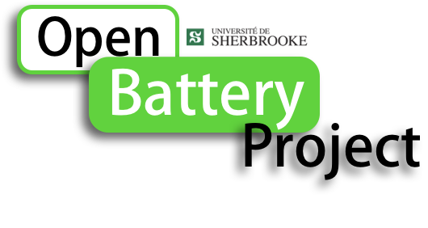
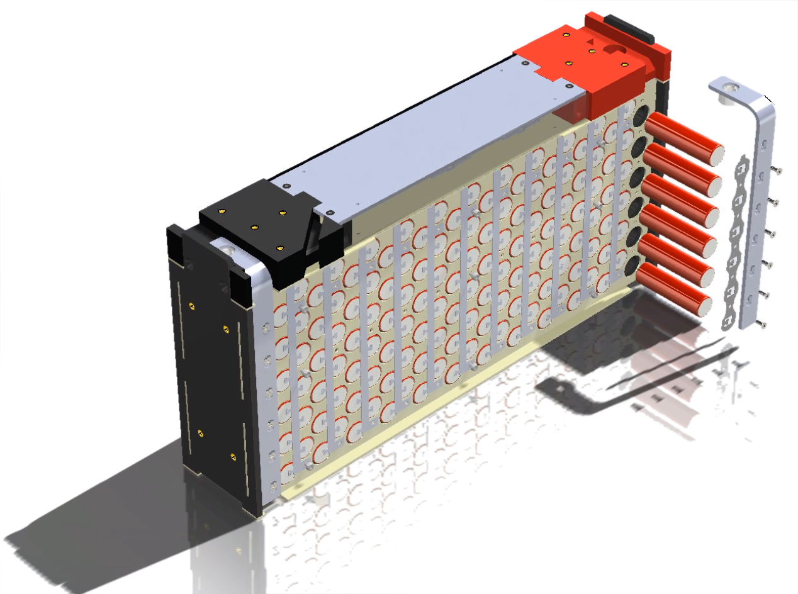
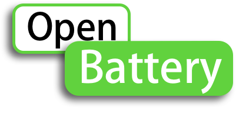

University of Sherbrooke has been working on Lithium-ion batteries since 2008 through research projects, capstone projects and ectra-curricular teams. In 2016, a modular, scalable, low-cost, easy to manufacture and affordable design was developped by the Electric Motorcycle Team EMUS. Under the supervision of Professor Joao Pedro Trovao of the e-TESC Laboratory, the mechanical design was lead by Félix-A. LeBel, and Battery Management system design was lead by Pascal Messier. Since then design has evolved and matured through various adaptations to other types of vehicles (Formula SAE, Electric Three wheeler,...). This design made of 18650 cyclindral cells is perfect for student projects, low volume prototypes, DIY projects or research. 

We intent to provide here a modular mechanical structure for a rapid-prototyping and an integrated Battery Management System (BMS) for some specfic cells configuration <b>(available soon)<b> 

<b> Always be carefull with lithium-ion. Bare lithium-ion cells should be handled with great care. We do not guarantee success in your application. <b>
 
# Acknowledgment of sponsors
<b>(available soon)<b> 

# Acknowledgment of contributors

Here is a list of contributors  who have been involved in the design, modification, fabrication or support of this project, before it was known as OpenBattery.

Alexis Bélanger
Alexandre Hétu
Albert Bourassa
Alexandre Joly
Alexandre Tessier
Antoine Vachon
Benjamin Bédard
Claude-Samuel Chrétien
Donovan Martin
Étienne Savard
Guillaume Auclair
Jerémie Pelletier
Jonathan Labbé
Julien Bourassa
Justin Trachy-Cloutier
Kaële Montplaisir
Louis Pelletier
Michel Tulane
Maxime Brodeur
Marc-Olivier Lemieux
Nicholas Turcotte
Olivier Lecompte
Pier-Geoffrey Boucher
Pier-Luc Morissette
Rémy Martin
Renaud Bourassa
Samuel Lavoie-April
Simon Lavigne
Valérie Arsenault
Victor Bruscianu
William Brodeur
William Bourque

# The Battery Module

# Bill of materials

<b>(available soon)<b> 
 
# List of publications

<b>(available soon)<b>  

# License
This work is shared under the License Creative Common Attribution-ShareAlike 4.0 International (CC BY-SA 4.0). Please share your work and contribute to OpenBattery Project.

 
 
# Graphic identification 
The following logo must be used to identify the project in publications. Prototypes or vehicules powered by a lithium-ion battery system made of OpenBattery modules must bare the following logo.
  
